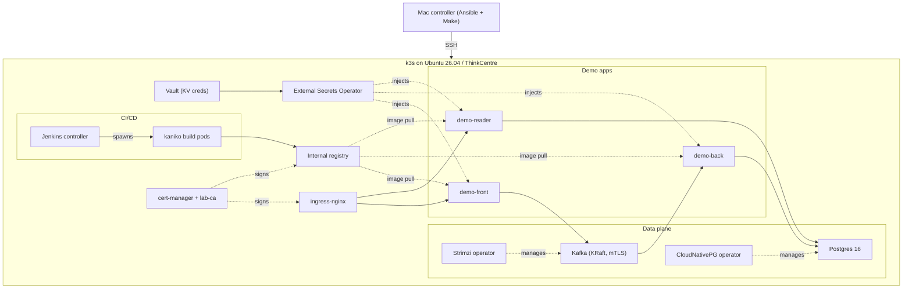

# SRE Coding Challenge

You are tasked with deploying a solution to the Kubernetes cluster. You may use Minikube, Microk8s, k3s or any other Kubernetes distribution.
Solution consists of three SpringBoot applications, Kafka deployment to support messaging and PostgreSQL database to provide a persistence layer.
Application deployment should use helm (https://helm.sh/), Kafka and Postgres may be deployed with any technology you like.

We do not expect too much automation (a few bash scripts should work just fine). In case you prefer to automate everything,
you may use any flavor of automation tools, Ansible, Terraform – everything will work. You may even set up a CI / CD flow using Jenkins/Tekton/Drone/etc. ;)

## Overall architecture


## Deployment layout


## Kafka Topic specs

- name: testCommand
- partitions: 32
- replication-factor: 1

## Database

Application developed with PostgreSQL 16+

Database schema created with Back application first run

## Applications

### Build applications

You need Java 21+ installed, then run

`./gradlew clean build`

to build applications. Jar files will land in `app/back/build/libs/back-0.1.0.jar` (Back app for instance)

### Hints

Few hints to simplify application deployment.

Docker:
`ENTRYPOINT ["java", "-jar", "/app.jar"]`

SpringBoot additional config arg if needed. Additional config values will override default.
`--spring.config.additional-location=path-to-additional-config`

Health check exposed as
`http://localhost:{management.server.port}/health`

Applications expose API management interface as
`http://localhost:{server.port}/swagger-ui.html`

### Front

Sample application configuration `application.yaml` file

```yaml
server.port: 8080
################### Kafka ##############################
spring:
  kafka:
    bootstrap-servers: -kafka-bootstrap-goes-here-

################### Logging settings ###################
logging:
  level:
    root: WARN
    db.demo: INFO

management.server.port: 8081
```

### Back

Sample application configuration `application.yaml` file

```yaml
spring:
  kafka:
    bootstrap-servers: -kafka-bootstrap-goes-here-
  datasource.url: jdbc:postgresql://localhost:5432/postgres
  datasource.username: -username-
  datasource.password: -password-

management.server.port: 8081
```

Hint:
You may use Spring Boot relaxed binding to pass parameters through environment variables
https://docs.spring.io/spring-boot/reference/features/external-config.html#features.external-config.typesafe-configuration-properties.relaxed-binding

`SPRING_DATASOURCE_USERNAME=postgres`

### Reader

Sample application configuration `application.yaml` file

```yaml
spring:
  datasource.url: jdbc:postgresql://localhost:5432/postgres
  datasource.username: -username-
  datasource.password: -password-

management.server.port: 8081
```

---

## A note on AI assistance

I paired with Anthropic's Claude (via Claude Code) throughout this
exercise, and I want to be upfront about it. The choice was deliberate:
my goal was to deliver the most professional, production-grade solution
I could put together in the available time, and modern engineering
practice — at every team I've seen ship seriously over the last year —
now treats an LLM pair-programmer the same way it treats `git`,
`kubectl` or an IDE: a tool that lets a senior engineer move faster
without giving up ownership of the design or the responsibility for
what gets shipped.

The scope here is well above a "few bash scripts": real Kubernetes
distro on bare metal, two stateful operators (Strimzi, CloudNativePG),
a secrets plane (Vault + ESO), TLS everywhere via a self-signed lab CA,
an in-cluster CI/CD pipeline that builds and deploys itself, and the
same stack lifted to GKE on a side branch to verify the design isn't
on-prem-only. Picking up brand-new tooling (KRaft Kafka, ESO, kaniko,
GKE Dataplane V2 with Cilium NetworkPolicy semantics) inside one
take-home would not have been realistic at production quality without
that acceleration.

**Every architectural call is mine.** k3s over Minikube, Strimzi +
CloudNativePG over hand-rolled StatefulSets, Vault + ESO over secrets
in git, in-cluster Jenkins with kaniko over an external runner,
default-deny NetworkPolicies + Pod Security Standards on every
namespace, the self-signed CA pushed into each node's trust store, the
clean split between Ansible bring-up and the Jenkins app pipeline, the
GKE branch with Workload Identity + Secret Manager CMEK. Each came with
a trade-off I weighed up-front — they're written down in the table
below.

What Claude actually did: scaffolded Ansible roles and Helm templates
faster than I would have typed them, produced most of the prose in this
README, and acted as a rubber duck on the real failures — Strimzi KRaft
quirks, kaniko's TLS to the private registry, CNPG's bootstrap secret
coupling with ESO, NetworkPolicy CIDR mismatches when I forked the GKE
branch, Jenkins RBAC for the WebSocket `sh` step. Every change was then
run on the actual lab. The full `make wipe` → `make all` cycle was
repeated end-to-end on a clean cluster, more than once, to prove the
bring-up is genuinely idempotent — not just "works on my machine".

## Architecture & design choices



### Why these components

| Pick | Why, in one sentence |
|---|---|
| **k3s on bare-metal Ubuntu** | A real multi-node cluster on the lab boxes — Minikube/k3d would hide the bring-up work (networking, ingress IP, LoadBalancer vs NodePort) the challenge actually rewards. |
| **Ansible** for bring-up | Idempotent `make all`, single inventory driving every IP / hostname / NetworkPolicy CIDR. Works on 1 node or 5 without code changes. |
| **Strimzi** for Kafka | Kafka as CRDs (`Kafka`, `KafkaUser`, `KafkaTopic`) with mTLS + ACLs out of the box and KRaft mode — no ZooKeeper, no manual user/topic management. |
| **CloudNativePG** for Postgres | Same operator pattern as Strimzi: one `Cluster` CR, bootstrap secrets, backups, PDB. Hand-rolled StatefulSets aren't worth the maintenance. |
| **Vault + ESO** | Apps never read Vault directly — ESO materialises `Secret` objects in each namespace from Vault KV. One place to rotate creds, no secrets in git. |
| **Jenkins + kaniko** | Pipeline runs in-cluster (no external runner needs to reach the lab). Kaniko builds images without a Docker daemon, so the build pod stays unprivileged. |
| **cert-manager + lab CA** | A single `ClusterIssuer` signs every internal cert (ingress, registry, Jenkins). The CA is pushed into each node's trust store so kaniko pulls/pushes without `--insecure-registry`. |
| **Default-deny NetworkPolicies + PSS** | Every namespace starts denied and opens only the paths it actually needs. Restricted PSS in app namespaces, baseline in `jenkins-build` (kaniko needs root to unpack layers). |
| **`*.IP.nip.io` ingress** | No real DNS in the lab — `front.192.168.10.51.nip.io` resolves on its own. One inventory variable drives every hostname. |
| **LimitRange + ResourceQuota** | Any new pod missing requests/limits gets sensible defaults and a hard max; demo tenants get a per-namespace budget so a runaway build can't take the node down. |

## Repository layout

```
.
├── app/                          Original challenge applications (Spring Boot 3)
│   ├── front/  back/  reader/    Three Kotlin services (gradle multi-module)
│   └── common/                   Shared message model
├── docker/
│   ├── Dockerfile                Distroless image used by the pipeline
│   └── smoke-test.sh             End-to-end smoke (POST front → GET reader)
├── charts/app/                   Generic Helm chart all three apps share
│   ├── templates/                Deployment / Service / Ingress / NP / ESO
│   └── values-{front,back,reader}.yaml
├── k8s/                          Static manifests applied by Ansible
│   ├── namespaces.yaml           Managed ns + PSS labels
│   ├── quotas.yaml               LimitRange + ResourceQuota
│   ├── network-policies/         Per-component NPs
│   ├── kafka/                    Strimzi Kafka cluster + KafkaUser/Topic
│   ├── postgres/                 CNPG Cluster
│   ├── vault/                    Vault Helm values + bootstrap
│   ├── eso/                      ClusterSecretStore + ExternalSecrets
│   ├── cert-manager/             lab-ca ClusterIssuer + Certificate
│   ├── ingress-nginx/            Helm values
│   ├── jenkins/                  Helm values + JCasC seed + RBAC
│   └── registry/                 Internal Distribution registry
├── deploy/ansible/
│   ├── inventory/                Hosts and group_vars (single source of truth
│   │                             for IPs, hostnames, versions)
│   ├── playbooks/                10-base → 50-app, run via `make cluster|infra|apps`
│   └── bootstrap/                One-shot scripts: SSH key, Ubuntu autoinstall
│                                 USB image generator
├── Jenkinsfile                   Declarative pipeline (gradle → kaniko → helm → smoke)
├── Makefile                      All entry points — `make help` lists them
├── doc/
│   ├── img/                      Architecture diagrams (challenge brief)
│   ├── trivy.md                  How to run + interpret Trivy scans
│   └── reports/                  Dated Trivy reports
├── .trivyignore                  Accepted findings, with reason inline
└── .kube-linter.yaml             kube-linter exclude list, with reason inline
```

## Running it

Tested on three ThinkCentre boxes running Ubuntu 26.04 LTS, but the
playbooks don't care — add or remove hosts in
`deploy/ansible/inventory/hosts.yml` and `make all` re-derives everything
from the inventory.

```bash
make all                  # k3s + Vault + ESO + Kafka + Postgres + registry + Jenkins
make creds                # Jenkins admin URL + password
make ci-deploy            # trigger the pipeline: gradle → kaniko → helm → smoke
```

The pipeline runs the smoke test from inside the cluster. To repeat it from
your workstation (through the public ingress, not in-cluster Service):

```bash
make smoke
```

URLs come from `ingress_base_domain` in `group_vars/all.yml`; override
per call if you point at a different host:

```bash
FRONT_URL=https://front.192.168.10.51.nip.io \
READER_URL=https://reader.192.168.10.51.nip.io \
  make smoke
```

To tear it down:

```bash
make wipe CONFIRM=YES     # uninstall k3s on every inventory node
```
